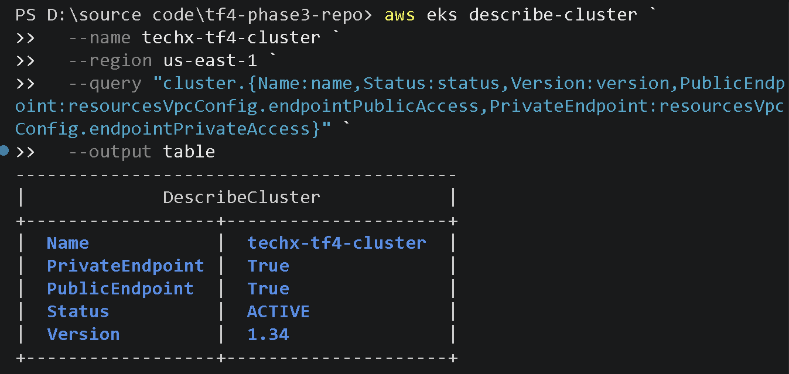

# MANDATE-10 — Runbook tái kiểm tra hợp nhất

**Người phụ trách:** Nguyễn Phú Triệu (CDO-07 Auditability)
**Repository:** `TF4-Phase3-TechX/tf4-phase3-repo`
**Phạm vi:** Provenance Chain và Human Approval Evidence

Runbook này dùng để tái kiểm tra trực tiếp trên hệ thống. Không lấy dữ liệu từ
file ảnh hoặc file JSON làm nguồn kiểm tra chính; JSON và ảnh chỉ là bản ghi
bằng chứng sau khi lệnh live đã chạy thành công.

## 1. Chuẩn bị và xác nhận tài khoản

```powershell
$repo = "TF4-Phase3-TechX/tf4-phase3-repo"
$namespace = "techx-tf4"
$cluster = "techx-tf4-cluster"
$region = "us-east-1"

gh auth status
aws sts get-caller-identity
```

Xác nhận tài khoản AWS là role Audit read-only trước khi thu thập dữ liệu
cluster/ECR.

## 2. Từ Pod lấy image digest

```powershell
aws eks update-kubeconfig `
  --name $cluster `
  --region $region `
  --alias techx-tf4-audit

kubectl config use-context techx-tf4-audit
kubectl get pods --namespace $namespace --output wide

$pod = "currency-858bcdfbc6-pq4rb"
$podJson = kubectl get pod $pod --namespace $namespace --output json | ConvertFrom-Json
$image = $podJson.spec.containers[0].image
$imageId = $podJson.status.containerStatuses[0].imageID

[PSCustomObject]@{
  Pod       = $pod
  Namespace = $namespace
  Container = $podJson.spec.containers[0].name
  Image     = $image
  ImageID   = $imageId
} | Format-List
```

Kết quả cần ghi nhận image tag và `sha256:` digest từ `ImageID`.




## 3. Đối chiếu digest với ECR

Tách repository và digest từ kết quả live, sau đó gọi ECR:

```powershell
$repository = "techx-corp"
$digest = "sha256:663bf6d56564e82cd767233bb70c45df6818a18d64781a7dc37732a4247e791c"

$ecr = aws ecr describe-images `
  --repository-name $repository `
  --image-ids "imageDigest=$digest" `
  --region $region | ConvertFrom-Json

$detail = $ecr.imageDetails[0]
[PSCustomObject]@{
  Repository = $repository
  ImageDigest = $detail.imageDigest
  ImageTags = ($detail.imageTags -join ", ")
  DigestMatch = ($detail.imageDigest -eq $digest)
  ImageScanStatus = $detail.imageScanStatus.status
} | Format-List
```

Kết quả đạt yêu cầu khi `DigestMatch` là `True`.


## 4. Xác minh chữ ký và attestation

Dùng Cosign trên image digest, với identity regex của workflow GitHub Actions:

```powershell
$registry = "511825856493.dkr.ecr.us-east-1.amazonaws.com"
$imageRef = "$registry/techx-corp@$digest"

aws ecr get-login-password --region $region |
cosign verify-attestation `
  --registry-username AWS `
  --registry-password-stdin `
  --type custom `
  --certificate-identity-regexp "^https://github.com/TF4-Phase3-TechX/tf4-phase3-repo/.github/workflows/.*@refs/heads/main$" `
  --certificate-oidc-issuer "https://token.actions.githubusercontent.com" `
  $imageRef
```

Exit code `0` cùng certificate/claims/transparency log hợp lệ là bằng chứng
chữ ký. Payload attestation cần được đọc để xác nhận repository, commit,
workflow, run ID, image digest và SBOM.


P1-05 hiện chỉ là ảnh cần chụp lại. Khi chụp lại, lấy vulnerability count từ
đúng thuộc tính `data.sbom.document.vulnerabilities`, không đọc thuộc tính
không tồn tại `data.sbom.vulnerabilities`.

## 5. Từ commit đến Pull Request

```powershell
$prNumber = 443
$provenanceSha = "a93093665767a27c40b71e6597b10c1ce20dd702"
$pr = gh api "repos/$repo/pulls/$prNumber" | ConvertFrom-Json

[PSCustomObject]@{
  PRNumber       = $pr.number
  Title          = $pr.title
  State          = $pr.state
  Merged         = $pr.merged
  BaseBranch     = $pr.base.ref
  HeadSHA        = $pr.head.sha
  MergeCommitSHA = $pr.merge_commit_sha
  ProvenanceSHA  = $provenanceSha
  CommitMatch    = ($pr.merge_commit_sha -eq $provenanceSha)
  MergedAt       = $pr.merged_at
  MergedBy       = $pr.merged_by.login
  URL            = $pr.html_url
} | Format-List
```

Kết quả đạt yêu cầu khi `Merged` là `True`, nhánh đích là `main` và
`CommitMatch` là `True`.


## 6. Lấy bằng chứng reviewer approval

```powershell
$reviews = gh api "repos/$repo/pulls/$prNumber/reviews" | ConvertFrom-Json

$approvedRows = @(
  foreach ($review in $reviews) {
    if ($review.state -eq "APPROVED") {
      [PSCustomObject]@{
        Reviewer    = $review.user.login
        State       = $review.state
        SubmittedAt = $review.submitted_at
        CommitID    = $review.commit_id
        URL         = $review.html_url
      }
    }
  }
)

$approvedRows | Format-Table -AutoSize
```

Đối chiếu `SubmittedAt` với `MergedAt`. Approval chỉ được tính là hợp lệ khi
xảy ra trước merge.


## 7. Kiểm tra branch protection của main

```powershell
$rulesets = gh api "repos/$repo/rulesets" | ConvertFrom-Json
$mainRule = $rulesets | Where-Object { $_.name -eq "main" } | Select-Object -First 1
$mainDetail = gh api "repos/$repo/rulesets/$($mainRule.id)" | ConvertFrom-Json

$pullRule = $mainDetail.rules |
  Where-Object { $_.type -eq "pull_request" } |
  Select-Object -First 1

$statusRule = $mainDetail.rules |
  Where-Object { $_.type -eq "required_status_checks" } |
  Select-Object -First 1

[PSCustomObject]@{
  Ruleset           = $mainDetail.name
  Enforcement       = $mainDetail.enforcement
  Branch            = "main"
  RequiredApprovals = $pullRule.parameters.required_approving_review_count
  CodeOwnerReview   = $pullRule.parameters.require_code_owner_review
  StatusChecks      = if ($null -ne $statusRule) { "CONFIGURED" } else { "NOT CONFIGURED - FINDING" }
} | Format-List
```

Kết quả đã thu thập: ruleset `main` active, yêu cầu 2 approvals, code-owner
review bật, required status checks chưa cấu hình.


## 8. Quy tắc chụp và lưu evidence

1. Chạy lệnh live trước, sau đó chụp output có đủ context, digest/commit/URL
   và kết quả PASS hoặc FINDING.
2. Đặt ảnh trong thư mục `images/` của bộ evidence này.
3. Cập nhật `MANDATE-10-AUDIT-RECORD.json` sau khi dữ liệu live đã được xác
   nhận; không dùng JSON để thay thế kiểm tra live.
4. Không đưa token, session key hoặc secret vào ảnh và tài liệu.
5. Không đính kèm ảnh Human Approval vào một PR Provenance riêng; hai phần đã
   được hợp nhất trong cùng bộ tài liệu và cùng PR.
