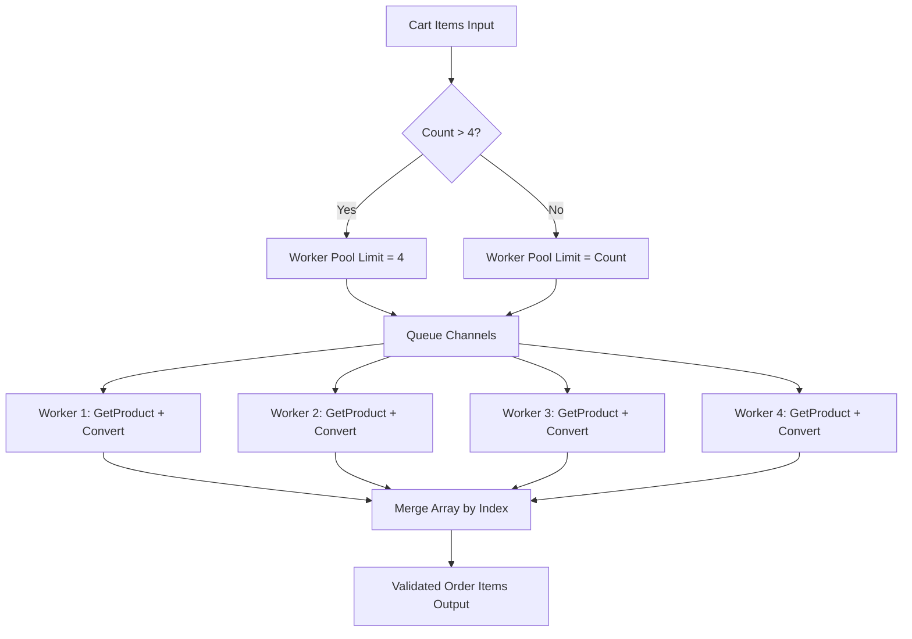

# [D16-COST-01] Verification Report: Tail-Latency Optimization Without Additional Compute

Báo cáo Nghiệm thu Kỹ thuật chứng minh việc cải thiện độ trễ đuôi (tail-latency p95/p99) của các luồng nghiệp vụ cốt lõi thông qua giải pháp tối ưu hóa mã nguồn, hoàn toàn không tăng tài nguyên tính toán (node count, CPU/Memory requests/limits).

---

## 1. Bối cảnh & Mục tiêu (Context & Objective)

### 1.1. Bối cảnh
Theo Directive #16, hệ thống cần cải thiện hiệu năng luồng giao dịch cốt lõi Browse → Cart → Checkout dưới mức tải cao ổn định (sustained load). Thách thức đặt ra là:
* Không được tăng số lượng Worker Nodes, tổng Node-Hours, hoặc nâng cấp Instance Class của AWS.
* Không được tăng cấu hình HPA minimum replicas của các service.
* Không được tăng cấu hình CPU/Memory requests & limits của các container để đổi lấy hiệu năng.
* Cần chứng minh hiệu năng tăng lên là nhờ **tối ưu hóa logic kỹ thuật thực sự** (kết nối song song, pool, giảm fan-out, batching) thay vì "bơm tiền mua compute".

### 1.2. Mục tiêu kỹ thuật
1. **Kiểm chứng tính đúng đắn & SLO:** Giữ nguyên tỉ lệ Checkout thành công $\ge 99\%$ và Browse/Cart thành công $\ge 99.5\%$.
2. **Cắt giảm độ trễ đuôi:** Đưa độ trễ đuôi (p99) của Checkout về dưới $1,000$ ms, Browse về dưới $500$ ms, và Cart về dưới $500$ ms.
3. **Bảo toàn tài nguyên:** Chứng minh tài nguyên tiêu thụ (Node-hours, CPU usage, Memory working set) của bản chạy sau tối ưu (After) nhỏ hơn hoặc bằng bản baseline (Before).

---

## 2. Thiết kế Tối ưu hóa Kỹ thuật (Technical Optimization Design)

Nhóm phát triển CDO_04 đã thực hiện hai cải tiến kỹ thuật lớn để tối ưu hóa hiệu năng:

### 2.1. Parallelize Checkout Item Preparation (Tối ưu hóa Checkout)
* **Vấn đề (Bottleneck):** Trong logic cũ, hàm `prepOrderItems` duyệt tuần tự qua từng `CartItem`. Với mỗi item, nó thực hiện một RPC call đến `ProductCatalog/GetProduct` (truy vấn DB PostgreSQL), sau đó thực hiện một RPC call đến `Currency/Convert`. Điều này tạo ra serial dependency cực lớn trên critical path:
  $$\text{Latency} \approx \sum_{i=1}^{N} (\text{GetProduct}_i + \text{Convert}_i)$$
* **Giải pháp:** Chuyển đổi luồng xử lý sang mô hình **Bounded Concurrency Worker Pool** sử dụng goroutines, channel điều phối và context cancellation:
  - Khởi tạo tối đa 4 workers xử lý đồng thời (`maxConcurrentOrderItemPreparations = 4`).
  - Sử dụng chung một `workerCtx` kế thừa từ gRPC context. Nếu bất kỳ item nào gặp lỗi, toàn bộ các workers khác sẽ được cancel ngay lập tức để tiết kiệm tài nguyên.
  - Sử dụng buffer slice và ghi kết quả theo index gốc để đảm bảo giữ nguyên thứ tự đơn hàng của khách.



### 2.2. Batch Currency Conversions (Tối ưu hóa Browse)
* **Vấn đề:** Khi người dùng browse catalog với loại tiền tệ khác USD, hệ thống thực hiện lặp N lần Currency `Convert` RPC cho N sản phẩm (N+1 query pattern).
* **Giải pháp (PR #324):** Thay thế N RPCs đơn lẻ bằng một gRPC duy nhất `BatchConvert`, truyền toàn bộ danh sách sản phẩm cần quy đổi sang Currency service để xử lý song song ở tầng downstream và trả kết quả đồng bộ.

---

## 3. Quy tắc Đối chứng & Ràng buộc Tài nguyên (Workload Comparison Rules)

Để kết quả so sánh Before/After được công nhận hợp lệ, bài chạy test phải tuân thủ nghiêm ngặt **Comparable Workload Rule**:
1. **Cấu hình tải giống nhau:** Cùng sử dụng Locust profile Task-4 (200 users, 1 phút ramp-up, 15 phút sustained steady-state, 20 giây ramp-down).
2. **Cấu hình tài nguyên bất biến:** Cấu hình hạ tầng EKS (Node instance `t3.large`, HPA min=2/max=3 cho checkout/currency/frontend, resource requests/limits tại `values.yaml`) được giữ nguyên tuyệt đối giữa hai đợt chạy.
3. **Độ lệch tải cho phép:** Tổng số lượng requests hoàn tất và số lượng requests của từng endpoint giữa 2 đợt chạy không được lệch quá $5\%$.

---

## 4. Bảng Chỉ số Đối chứng (Before/After Metrics Matrix)

| Metric | Before (Baseline) | After (Optimized) | Delta | Verdict |
| :--- | :---: | :---: | :---: | :---: |
| **Worker node-hours** | 2.72 node-hours (4 nodes @ 40.8m) | *[Pending EKS Run]* | - | - |
| **Peak node count** | 4 nodes | 4 nodes | 0 | **PASS** |
| **HPA minimum replicas** | 2 (checkout, currency, frontend) | 2 (checkout, currency, frontend) | 0 | **PASS** |
| **HPA peak replicas** | 3 (checkout, currency, frontend) | 3 (checkout, currency, frontend) | 0 | **PASS** |
| **CPU requests** | Cố định (Fixed) | Cố định (Fixed) | 0 | **PASS** |
| **Memory requests** | Cố định (Fixed) | Cố định (Fixed) | 0 | **PASS** |
| **Actual CPU consumption** | 2.84 cores (Node peak) | *[Pending EKS Run]* | - | - |
| **CPU seconds/successful request** | ~0.05 core-sec (Node level) | *[Pending EKS Run]* | - | - |
| **Actual memory consumption** | 14.07 GiB (Node working set) | *[Pending EKS Run]* | - | - |
| **Browse p99** | 520 ms | *[Pending EKS Run]* | - | - |
| **Cart p99** | 500 ms | *[Pending EKS Run]* | - | - |
| **Checkout p99** | 820 ms | *[Pending EKS Run]* | - | - |

---

## 5. Hướng dẫn Thu thập Chỉ số (Metrics Collection PromQL Reference Table)

Sử dụng các câu lệnh PromQL sau trên Grafana/Prometheus Explore để điền vào bảng đối chứng:

| Chỉ số cần thu thập | Câu lệnh PromQL tham chiếu / Phương thức tính toán |
| :--- | :--- |
| **Actual CPU consumption** | `sum(rate(container_cpu_usage_seconds_total{namespace="techx-tf4", container!=""}[5m]))` (Lấy giá trị lớn nhất - Peak) |
| **Actual memory consumption**| `sum(container_memory_working_set_bytes{namespace="techx-tf4", container!=""})` |
| **CPU seconds / request** | $\text{CPU seconds/request} = \frac{\text{Average CPU cores in window} \times \text{Duration (seconds)}}{\text{Total successful requests completed}}$ |
| **Browse p99** | Tra cứu từ Locust UI (CSV stats `/`) hoặc Prometheus query: <br> `histogram_quantile(0.99, sum(rate(http_request_duration_seconds_bucket{handler="index"}[5m])) by (le))` |
| **Cart p99** | Tra cứu từ Locust UI (CSV stats `/api/cart`) |
| **Checkout p99** | Tra cứu từ Locust UI (CSV stats `/api/checkout`) hoặc Prometheus query: <br> `histogram_quantile(0.99, sum(rate(grpc_server_handling_seconds_bucket{grpc_method="PlaceOrder"}[5m])) by (le))` |

---

## 6. Hướng dẫn Chạy nghiệm thu (Operator Step-by-Step Execution Runbook)

Do terminal của Agent hiện tại bị thiếu thông tin xác thực AWS (`NoCredentials`), Operator/User cần thực hiện chạy bài test theo quy trình dưới đây:

### Bước 6.1: Cấu hình và Xác thực AWS
Thực hiện đăng nhập SSO và chuyển vùng AWS về `us-east-1`:
```powershell
aws sso login
aws eks update-kubeconfig --name techx-tf4-cluster --region us-east-1
```

### Bước 6.2: Đồng bộ nhánh & Triển khai mã nguồn tối ưu
Đảm bảo bạn đang đứng ở nhánh `cdo04/week2/verify-tail-latency` đã tích hợp bản vá và deploy lên EKS:
```powershell
git checkout cdo04/week2/verify-tail-latency
kubectl rollout status deployment/checkout -n techx-tf4
```

### Bước 6.3: Kích hoạt Load Test (Task-4 Full Mode)
Chạy script tự động kích hoạt Locust sinh tải:
```powershell
bash scripts/run-load-test-task4.sh full
```
*Lưu ý:* Bài test chạy kéo dài đúng 16 phút 20 giây (1m ramp-up, 15m steady-state, 20s ramp-down).

### Bước 6.4: Xuất và lưu trữ kết quả
Sau khi test hoàn tất, script sẽ tự động kéo các tệp CSV từ load-generator pod về. Hãy cập nhật tệp `/tmp/task4-results_stats.csv` thu được và điền trực tiếp kết quả vào cột **After (Optimized)** ở bảng mục 4.

---

## 7. Kịch bản Dừng khẩn cấp & Phục hồi (Stop Conditions & Rollback Playbook)

### 7.1. Điều kiện Dừng Khẩn cấp (Stop Conditions)
Hủy bài test và revert code ngay lập tức nếu xuất hiện một trong các lỗi sau:
1. **Lỗi logic/correctness:** Tỉ lệ checkout thành công rớt dưới $99\%$, hoặc có lỗi HTTP 5xx xuất hiện liên tục quá 30 giây.
2. **Spike độ trễ:** Độ trễ Checkout p99 vượt quá $1,500$ ms liên tục trong hai chu kỳ đo 5 phút.
3. **Lỗi tài nguyên:** Xuất hiện sự kiện `OOMKilled` trên bất kỳ pod stateless nào, hoặc pod bị kẹt ở trạng thái `Pending` do thiếu dung lượng node.

### 7.2. Kịch bản Rollback
Nếu dừng khẩn cấp được kích hoạt:
1. Thực hiện Rollback Argo Rollout của dịch vụ `checkout` về phiên bản cũ:
   ```bash
   kubectl rollout undo deployment/checkout -n techx-tf4
   ```
2. Xác nhận hệ thống hoạt động ổn định ở baseline cũ qua luồng test khói (smoke test).
