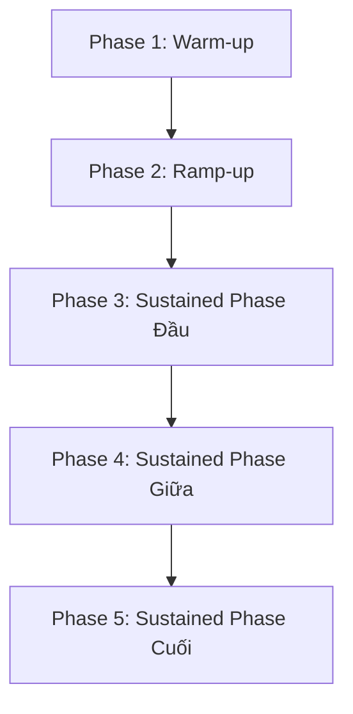

# [D16-PERF-06] Validate Tail-Latency Stability During Rising Sustained Load

**Jira:** `[D16-PERF-06] Validate Tail-Latency Stability During Rising Sustained Load`  
**Trạng thái Báo cáo:** Draft — Awaiting Test Run  
**Nhánh Git:** `cdo04/perf/checkout-stability-validation`  
**Thời gian chạy test:** *[Pending Run]*  

---

## 1. Objective & Contract
Xác minh p99 latency không spike, jitter hoặc degradation kéo dài khi tải tăng dần và được giữ ở mức cao (rising sustained load) trên luồng Browse → Cart → Checkout. 

### Load Test Contract
* **Target Peak Users:** 200 concurrent users.
* **Spawn Rate:** 3.34 users/second.
* **Duration:** 15 phút steady-state + 1 phút ramp-up + 20 giây ramp-down.
* **Namespace:** `techx-tf4` on EKS.

---

## 2. Phase-by-Phase Analysis

Dưới đây là phân tích chi tiết độ ổn định qua 5 giai đoạn liên tục của bài test tải:

### Phase 1 — Warm-up (Khởi động)
* **Thời gian:** T0 đến T0 + 2 phút (chạy nền trước test).
* **Trạng thái tải:** Tải thấp (~5-10 users).
* **Độ trễ p99 Checkout:** `___ ms`
* **CPU / Memory trend:** Khởi tạo tài nguyên ổn định, slope thấp.
* **Nhận xét & Verdict:** `[PASS / FAIL / PENDING]`  
  *[Mô tả: Khởi tạo các connection pool thành công, không có OOM hay lỗi kết nối ban đầu.]*

### Phase 2 — Ramp-up (Tăng tải)
* **Thời gian:** 1 phút (từ T0 đến T0 + 1m).
* **Trạng thái tải:** Tải tăng dần từ 0 lên 200 users.
* **Độ trễ p99 Checkout:** `___ ms`
* **CPU / Memory trend:** CPU tăng dần theo độ dốc tải (Ramp Slope).
* **Nhận xét & Verdict:** `[PASS / FAIL / PENDING]`  
  *[Mô tả: Latency không bị vọt đột ngột khi luồng users kết nối dồn dập.]*

### Phase 3 — Sustained Phase Đầu (Ổn định ban đầu)
* **Thời gian:** 5 phút đầu của Steady-State (T0 + 1m đến T0 + 6m).
* **Trạng thái tải:** Giữ cố định ở 200 users.
* **Độ trễ p99 Checkout:** `___ ms`
* **CPU / Memory trend:** Đạt đỉnh tạm thời và bắt đầu đi ngang.
* **Nhận xét & Verdict:** `[PASS / FAIL / PENDING]`  
  *[Mô tả: Hệ thống hấp thụ tải đỉnh ổn định, gRPC connection pools bắt đầu hoạt động đều.]*

### Phase 4 — Sustained Phase Giữa (Ổn định duy trì)
* **Thời gian:** 5 phút tiếp theo (T0 + 6m đến T0 + 11m).
* **Trạng thái tải:** Giữ cố định ở 200 users.
* **Độ trễ p99 Checkout:** `___ ms`
* **CPU / Memory trend:** Giữ slope gần như bằng 0 (flatline).
* **Nhận xét & Verdict:** `[PASS / FAIL / PENDING]`  
  *[Mô tả: Không có dấu hiệu cạn kiệt tài nguyên hay nghẽn hàng đợi Kafka.]*

### Phase 5 — Sustained Phase Cuối (Nghiệm thu dài hạn)
* **Thời gian:** 5 phút cuối của Steady-State (T0 + 11m đến T0 + 16m).
* **Trạng thái tải:** Giữ cố định ở 200 users.
* **Độ trễ p99 Checkout:** `___ ms`
* **CPU / Memory trend:** Ổn định dài hạn, không có rò rỉ bộ nhớ (leak).
* **Nhận xét & Verdict:** `[PASS / FAIL / PENDING]`  
  *[Mô tả: Đo đạc p99 cuối cùng trước khi xả tải. Xác nhận toàn bộ chỉ số an toàn.]*

---

## 3. Metrics Matrix (Chỉ số đo đạc thực tế)

| Metric | Ngưỡng cam kết (Target Budget) | Kết quả thực tế (Actual Observed) | Đánh giá (Verdict) | Nguồn dữ liệu (Source) |
| :--- | :---: | :---: | :---: | :--- |
| **Checkout p99 Latency** | $< 1,000$ ms | `___ ms` | `___` | Locust / Grafana |
| **Browse p99 Latency** | $< 500$ ms | `___ ms` | `___` | Locust / Grafana |
| **Cart p99 Latency** | $< 500$ ms | `___ ms` | `___` | Locust / Grafana |
| **Connection Pool Usage** | $< 85\%$ (không exhaustion) | `___ %` | `___` | Prometheus (`go_sql_conn_stats`) |
| **Kafka Queue Depth** | Lag $< 1,000$ messages | `___ msgs` | `___` | Prometheus (`kafka_consumergroup_lag`) |
| **Downstream Latency** | Catalog $< 300$ms, Currency $< 100$ms | `Catalog: ___ms`   `Currency: ___ms` | `___` | Jaeger / Prometheus (gRPC client spans) |
| **CPU Throttling** | Throttling $< 10\%$ CPU time | `___ %` | `___` | Prometheus (`container_cpu_cfs_throttled_seconds_total`) |
| **Retry Count** | Delta Retry $\approx 0$ (no retry storm) | `___ retries` | `___` | App logs / Prometheus |
| **Timeout Count** | Timeout $= 0$ | `___ timeouts` | `___` | App logs / Prometheus |
| **CPU/Memory Slope** | $\approx 0$ (Không phình tài nguyên) | `CPU: ___`   `Mem: ___` | `___` | Prometheus node/container usage |

---

## 4. Acceptance Criteria Status

- [ ] **Không có sustained p99 spike:** p99 Checkout không vượt quá budget $1,000$ms kéo dài quá 30 giây.
- [ ] **p99 không tăng dần không kiểm soát:** p99 giữ ổn định phẳng (flat) suốt sustained window.
- [ ] **Không có pool exhaustion:** Không có lỗi connection pool (`Too many connections` hoặc `sql: database is closed`).
- [ ] **Không có queue buildup:** Kafka lag trên các topic giao dịch không bị tích lũy liên tục.
- [ ] **Không có timeout/retry storm:** Số lượng retry và timeout không tăng vọt khi tải cao.
- [ ] **Latency budget giữ suốt sustained window:** Ngân sách độ trễ độ trễ đuôi được bảo toàn ở 200 users.
- [ ] **Có phase-by-phase verdict:** Có đánh giá đầy đủ cho cả 5 phase.

---

*Báo cáo này sẽ được cập nhật số liệu chính thức ngay sau khi bài chạy test tải hoàn tất thành công.*
