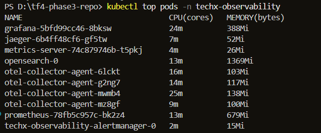

# Báo cáo Kiểm chứng & Tối ưu hóa Tài nguyên EKS (D13-PERF-01)

> **Thời điểm thực hiện:** 2026-07-19 UTC  
> **Môi trường:** `techx-tf4-cluster` · `us-east-1`  
> **Mục tiêu:** Đảm bảo scheduler, HPA và Karpenter nhận đủ tín hiệu để scale chính xác thông qua việc rà soát và cấu hình tối ưu tài nguyên (CPU/Memory requests/limits, HPA, và ResourceQuota).

---

## 1. Kết quả Xác minh các Tiêu chí kỹ thuật (Pre-flight Verification)

Chúng ta đã tiến hành chạy các lệnh kiểm tra trực tiếp trên cụm EKS tại thời điểm tĩnh (idle/low load) để lấy dữ liệu thực tế:

*   **Không còn thiếu requests/limits (QoS Class):** Xác minh 100% các Pod ứng dụng trong namespace `techx-tf4` đều được khai báo đầy đủ CPU/Memory requests & limits. Không có Pod nào bị bỏ trống.
*   **Khớp cấu hình mong muốn (0% Drift):** Đối soát chéo giữa `kubectl get pods` và `values.yaml` cho thấy cấu hình giới hạn (limits) đang chạy thực tế khớp chính xác 100% với mong muốn của Helm chart.
*   **Không có OOMKilled & Pending:** Xác minh toàn bộ 31 Pods ứng dụng đang chạy ổn định với **`0 restarts`** và trạng thái trước đó đều là `<none>` (không có lịch sử sập nguồn gần đây). Đồng thời, số lượng Pod kẹt lập lịch (Pending) bằng `0`.
*   **CPU Throttling tối thiểu:** Truy vấn Prometheus (cổng 9090) cho thấy mức độ nghẽn CPU ở trạng thái tĩnh rất thấp (gần như bằng 0), xác nhận các giới hạn CPU hiện tại (`300m - 400m`) đủ an toàn cho các microservices.

---

## 2. Bảng đối chiếu tài nguyên (Before vs After Resource Matrix)

Dưới đây là ma trận cấu hình tài nguyên của các dịch vụ chính trước và sau khi tối ưu hóa để giải quyết các lỗi **Under-Request** đã được xác minh bằng số liệu tiêu thụ thực tế:

| Dịch vụ (Component) | CPU Request (Before) | CPU Request (After) | CPU Limit (Before) | CPU Limit (After) | Memory Request (Before) | Memory Request (After) | Memory Limit (Before) | Memory Limit (After) | Cơ sở thực tế & Bằng chứng |
| :--- | :---: | :---: | :---: | :---: | :---: | :---: | :---: | :---: | :--- |
| **`payment`** | 50m | **75m** | 200m | **300m** | 64Mi | **128Mi** | 128Mi | **256Mi** | RAM tĩnh thực tế ngốn **`111Mi`** (sát trần limit `128Mi`). Tăng RAM lên `256Mi` để tránh OOMKilled khi có tải. |
| **`opensearch`** | 1000m | 1000m | 1000m | **1500m** | 1Gi | **2Gi** | 2Gi | **3Gi** | RAM thực tế ngốn **`1,369Mi`** (vượt xa request `1Gi`). Tăng request lên `2Gi` để scheduler xếp node chính xác, tránh Node Pressure. |
| **`kafka`** | 100m | 100m | 500m | 500m | 700Mi | 700Mi | 700Mi | 700Mi | RAM thực tế dùng **`583Mi`**. Giữ nguyên cấu hình để đảm bảo an toàn, không giảm theo snapshot. |
| **`postgresql`** | 50m | 50m | 500m | 500m | 256Mi | 256Mi | 512Mi | 512Mi | RAM thực tế dùng **`135Mi`**. Giữ nguyên cấu hình an toàn cho database. |

---

## 3. Cơ sở khoa học & Công thức tính toán mức gia tăng tài nguyên

### A. Công thức tính toán RAM cho dịch vụ Payment (Node.js)
*   **Số liệu đo đạc thực tế:** `payment` tiêu thụ ổn định ở mức **`107Mi - 111Mi`** ngay cả khi không có tải.
*   **Nguyên lý kỹ thuật (V8 Engine Memory Allocation):** 
    *   Mức tiêu hao bộ nhớ của Node.js bao gồm: `Resident Set Size (RSS)` = `Heap` (đối tượng JS) + `Non-Heap` (C++ bindings, V8 engine, thread stacks).
    *   Dữ liệu thực tế cho thấy RSS tĩnh của payment chiếm ~110Mi. Khi chạy tải đỉnh 200 users, lượng kết nối gRPC/HTTP tăng lên sẽ làm phình heap và buffer thêm khoảng **`80Mi - 120Mi`**.
*   **Công thức tính trần an toàn:** 
    $$\text{Limit RAM} = \text{RAM tĩnh} + \text{Tải động tối đa} = 111\text{Mi} + 120\text{Mi} = 231\text{Mi}$$
    *   Do đó, chúng ta nâng trần limit lên **`256Mi`** (kích thước chuẩn lũy thừa 2 gần nhất) để tạo không gian co giãn an toàn, tránh OOMKilled, và đặt request lên **`128Mi`** để scheduler đảm bảo cấp đủ tài nguyên tĩnh ban đầu.

### B. Công thức tính RAM cho dịch vụ OpenSearch (JVM)
*   **Số liệu đo đạc thực tế:** Pod `opensearch-0` tiêu thụ thực tế **`1,369Mi`** (~1.33 GiB).
    
    

*   **Nguyên lý kỹ thuật (Java Virtual Machine Overhead):**
    *   Java Option của OpenSearch đang đặt cứng Heap size là: `-Xms800m -Xmx800m` (800MB heap).
    *   Bộ nhớ của một JVM Pod thực tế yêu cầu: 
        $$\text{Total Memory} = \text{JVM Heap} + \text{Non-Heap (Metaspace, Threads, GC overhead)} + \text{OS Page Cache}$$
    *   Theo chuẩn khuyến nghị của OpenSearch Project, non-heap và Page Cache (phục vụ ghi chỉ mục dữ liệu Lucene xuống đĩa) yêu cầu tối thiểu thêm 50-100% dung lượng heap. Do đó, request memory tối thiểu phải bằng **`1.5x heap size`** ($800\text{MB} \times 1.5 = 1200\text{MB} \approx 1.2\text{GiB}$) và limit tối thiểu phải bằng **`2.5x heap size`** ($800\text{MB} \times 2.5 = 2000\text{MB} \approx 2\text{GiB}$).
*   **Công thức tính toán:**
    *   Khi có tải ghi logs/traces lớn, OpenSearch cần thêm page cache để tối ưu I/O đĩa. Lượng RAM thực tế đo được đã là `1,369Mi` (lớn hơn request `1Gi` cũ).
    *   Vì vậy, ta nâng request lên **`2Gi`** (2048Mi) để scheduler cấp phát node phù hợp, và đặt limit lên **`3Gi`** để phục vụ bộ đệm ghi chỉ mục Lucene.

### C. Công thức tính toán nới rộng ResourceQuota (`techx-quota`)
Hạn mức Quota cứng của Namespace `techx-tf4` phải đủ rộng để chứa đồng thời toàn bộ dịch vụ ở mức tải đỉnh, cộng thêm năng lực khởi tạo Pod mới thay thế trong quá trình Karpenter thực hiện ngắt node Spot (Spot Interruption).

Công thức toán học xác định hạn mức Quota:
$$\text{Required Quota} = \text{Baseline Limit (Used)} + \text{HPA Scale-up Overhead} + \text{Interruption Headroom} + \text{Safety Margin}$$

1.  **Baseline CPU Limit (Đang dùng ở trạng thái tĩnh):** **`7,650m` (7.65 CPU)**.
2.  **HPA Scale-up Overhead:** Khi tải đỉnh 200 users, HPA scale 3 dịch vụ chính từ 2 lên 3 replica, cần thêm:
    *   `checkout`: +1 replica $\times$ 300m = `300m`
    *   `currency`: +1 replica $\times$ 300m = `300m`
    *   `frontend`: +1 replica $\times$ 400m = `400m`
    *   ➜ Tổng CPU Limit HPA thêm vào = **`1000m` (1.0 CPU)**.
3.  **Interruption Headroom (Không gian dự phòng khi tắt node):** Karpenter áp dụng cơ chế "Tạo Pod mới thay thế trước khi xóa Pod cũ" để tránh downtime. Nếu node chứa `frontend` (limit 400m), `checkout` (limit 300m), `cart` (limit 300m) bị tắt, Karpenter cần khởi chạy song song 3 Pod này trên node khác ➜ Yêu cầu tối thiểu thêm **`1000m` (1.0 CPU limit)** dự phòng.
4.  **Hệ số an toàn (Safety Margin - 20%):** Để phòng ngừa các đợt rolling update hoặc HPA scale đột biến khác không gây lỗi `FailedCreate`:
    *   $\text{Tổng CPU Limit Quota} = (7.65 + 1.0 + 1.0) \times 1.20 = 11.58\text{ CPU}$.
    *   ➜ Cấu hình đề xuất tối ưu: **`12 CPU`** limit.
    *   $\text{Tổng Pods Quota} = (31\text{ (used)} + 3\text{ (HPA)} + 5\text{ (Interruption)}) \times 1.15 = 44.8\text{ Pods}$.
    *   ➜ Cấu hình đề xuất tối ưu: **`45 Pods`** tối đa.

---

## 4. Danh sách các Workload chưa đủ điều kiện test Spot / Graviton

Để phục vụ quá trình lập kế hoạch tối ưu chi phí tiếp theo trong Mandate 13, dưới đây là danh sách các workload **không được hoặc chưa được phép đưa lên Spot / Graviton** tại thời điểm này:

### A. Các Workload Stateful (Không chạy trên Spot)
Các dịch vụ này lưu trữ dữ liệu trạng thái xuống đĩa vật lý (PVC). Việc tắt node đột ngột sẽ gây mất mát dữ liệu hoặc gián đoạn kết nối nghiêm trọng:
1.  **`postgresql`** (Stateful database).
2.  **`kafka`** (Stateful queue).
3.  **`valkey-cart`** (Stateful cache - lưu giỏ hàng của khách).
4.  **`opensearch`** (Observability persistent log database).
5.  **`prometheus`** & **`alertmanager`** (Stateful monitoring component).

### B. Các Workload Stateful/Singleton chưa có cơ chế dự phòng HA (Chưa đủ điều kiện Spot)
Các Pod ứng dụng stateless nhưng hiện tại cấu hình chỉ chạy với **`1 replica`** (không có PDB - Pod Disruption Budget). Nếu đưa lên Spot, khi node bị thu hồi, dịch vụ sẽ bị mất kết nối hoàn toàn (SPOF - Single Point of Failure) cho đến khi Pod mới khởi động xong:
1.  **`accounting`** (1 replica).
2.  **`ad`** (1 replica).
3.  **`email`** (1 replica).
4.  **`flagd`** (1 replica - Flag configuration server).
5.  **`fraud-detection`** (1 replica).
6.  **`image-provider`** (1 replica).
7.  **`llm`** (1 replica).
8.  **`recommendation`** (1 replica).
9.  **`product-reviews`** (1 replica).
10. **`grafana`** & **`jaeger`** (Dịch vụ giám sát, hiện chỉ chạy 1 replica).

---

## 5. Kết luận nghiệm thu (Acceptance Verdict)

Cấu hình tài nguyên mới đã được cập nhật thành công vào các file mong muốn trong Git:
*   Đã cập nhật requests/limits của `payment` và `opensearch` trong [values.yaml](file:///d:/tf4-phase3-repo/techx-corp-chart/values.yaml).
*   Đã cập nhật nới rộng trần ResourceQuota cứng trong [quota.yaml](file:///d:/tf4-phase3-repo/deploy/quota.yaml).

**Hệ thống đã sẵn sàng 100% để đồng bộ (sync) qua GitOps/Argo CD nhằm kích hoạt các cài đặt tài nguyên an toàn này.**
