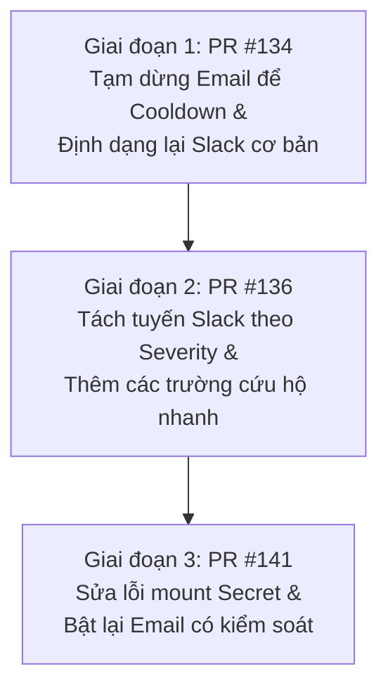

# Tài liệu Khắc phục & Cấu hình AlertManager (Email & Slack Alerts)

Tài liệu này ghi nhận quá trình chuẩn hóa hệ thống cảnh báo (Alerting), khắc phục lỗi gửi Email và cải tiến định dạng tin nhắn Slack của AlertManager tại TechX Corp. Quá trình này được thực hiện qua chuỗi 3 Pull Requests liên tiếp nhằm giải quyết triệt để lỗi vận hành và nâng cao trải nghiệm On-call.

---

## 1. Tổng quan vấn đề & Tiến trình xử lý

Hệ thống giám sát ban đầu gặp hai vấn đề lớn:
1. **Lỗi Email Alert:** AlertManager liên tục báo lỗi xác thực khi gửi mail qua SMTP của Gmail.
2. **Slack Alert khó đọc:** Tin nhắn Slack mặc định hiển thị quá nhiều label nhiễu, không phân biệt mức độ nghiêm trọng (severity) và thiếu các thông tin cứu hộ nhanh (runbook, hành động gợi ý).

Tiến trình khắc phục được chia làm 3 giai đoạn chính:



---

## 2. Chi tiết các giai đoạn khắc phục

### Giai đoạn 1: Định dạng Slack cơ bản & Tạm dừng Email (PR #134)
* **Root Cause lỗi SMTP:** Trước đó, cấu hình đường dẫn tệp chứa mật khẩu SMTP (`smtp_auth_password_file`) bị chỉ định sai thành `/etc/alertmanager/secrets/password`. Trong khi đó, ExternalSecret đồng bộ từ AWS Secrets Manager lưu mật khẩu dưới khóa `smtp-password` (được mount tại `/etc/alertmanager/secrets/smtp-password`).
* **Hệ quả:** AlertManager liên tục retry kết nối với SMTP Gmail bằng mật khẩu trống/sai, dẫn đến việc Gmail chặn/throttle IP của hệ thống với lỗi:
  `454 4.7.0 Too many login attempts`
* **Giải pháp:**
  - Tạm thời comment-out cấu hình `email_configs` dưới receiver mặc định `email-notifications` để dừng vòng lặp retry, giúp IP hệ thống cooldown.
  - Thêm cấu hình Slack formatting cơ bản (color, title, text) thông qua Custom Go Template để đội ngũ giám sát có thể đọc cảnh báo trên Slack trong lúc Email bị tạm dừng.

### Giai đoạn 2: Phân tuyến cảnh báo theo Severity & Nâng cấp Slack Template (PR #136)
* **Mục tiêu:** Giúp đội ngũ On-call nhận diện cảnh báo khẩn cấp (`critical`) nhanh hơn, tránh bị trôi tin nhắn cảnh báo trong kênh Slack `#tf4-alerts`.
* **Giải pháp:**
  - Đổi thuộc tính gom nhóm `group_by` từ `[alertname]` thành `[alertname, severity]` để tách biệt luồng xử lý cảnh báo.
  - Tách tuyến routing thành hai nhánh con:
    - **Cảnh báo Critical (`severity="critical"`):** Gửi tới receiver mới `critical-slack-notifications`, lặp lại mỗi **30 phút** (`repeat_interval: 30m`) để On-call liên tục chú ý.
    - **Cảnh báo Warning (`severity="warning"`):** Gửi tới receiver mặc định `email-notifications`, lặp lại mỗi **2 giờ** (`repeat_interval: 2h`).
  - **Nâng cấp nội dung Slack Custom Template:** Bổ sung các trường thông tin quan trọng giúp On-call xử lý sự cố tức thì:
    - `Started` (Thời gian bắt đầu)
    - `Service` (Tên dịch vụ gặp lỗi)
    - `Namespace` (Namespace xảy ra lỗi)
    - `Pod` (Tên Pod cụ thể nếu có)
    - `Action` / `Runbook` (Hành động cứu hộ gợi ý và link tài liệu vận hành tương ứng).

### Giai đoạn 3: Phục hồi Email Alert có kiểm soát (PR #141)
* **Bối cảnh:** Sau hơn 3 giờ tạm dừng, Gmail SMTP đã kết thúc thời gian chặn (cooldown). ExternalSecret đã đồng bộ thành công khóa chính xác `smtp-password`.
* **Giải pháp:**
  - Bật lại cấu hình `email_configs` dưới receiver mặc định `email-notifications` (dành cho Warning).
  - Trỏ chính xác tham số `smtp_auth_password_file` về `/etc/alertmanager/secrets/smtp-password`.
  - Để đảm bảo kiểm soát rủi ro, receiver `critical-slack-notifications` trong giai đoạn này vẫn giữ nguyên chế độ **chỉ gửi Slack**, tránh việc spam email đồng loạt gây throttle Gmail trở lại.
  - Email nhận cảnh báo được chuẩn hóa về Google Group: `tf4-audit-oncall@googlegroups.com`.

---

## 3. Cấu hình chi tiết Before & After (`alertmanager-routing-values.yaml`)

Dưới đây là phần so sánh cấu hình trong file `environments/production/alertmanager-routing-values.yaml` (hoặc tương đương trong GitOps) để so sánh chi tiết:

### Cấu hình cũ bị lỗi (Before)
```yaml
prometheus:
  alertmanager:
    extraSecretMounts:
      - name: smtp-auth
        secretName: alertmanager-smtp-auth
        mountPath: /etc/alertmanager/secrets
        readOnly: true
      - name: slack-webhook
        secretName: alertmanager-slack-webhook
        mountPath: /etc/alertmanager/slack
        readOnly: true
    config:
      global:
        resolve_timeout: 5m
        smtp_smarthost: 'smtp.gmail.com:587'
        smtp_from: 'tf4-on-call-email@gmail.com'
        smtp_auth_username: 'tf4-on-call-email@gmail.com'
        smtp_auth_password_file: '/etc/alertmanager/secrets/password' # LỖI: Sai tên file mật khẩu
        smtp_require_tls: true
      route:
        group_by: ['alertname']
        group_wait: 10s
        group_interval: 10s
        repeat_interval: 3h
        receiver: 'email-notifications' # Gửi chung tất cả cảnh báo vào một receiver
      receivers:
        - name: 'email-notifications'
          slack_configs:
            - channel: '#tf4-alerts'
              api_url_file: '/etc/alertmanager/slack/webhook-url'
              send_resolved: true
              # LỖI: Thiếu custom Slack template (dễ gây nhiễu thông tin)
          email_configs:
            - to: 'vanphutin2902@gmail.com'
              send_resolved: true
            - to: 'ngonguyentruongan2907@gmail.com'
              send_resolved: true
```

### Cấu hình mới đã tối ưu và sửa lỗi (After)
```yaml
prometheus:
  alertmanager:
    extraSecretMounts:
      - name: smtp-auth
        secretName: alertmanager-smtp-auth
        mountPath: /etc/alertmanager/secrets
        readOnly: true
      - name: slack-webhook
        secretName: alertmanager-slack-webhook
        mountPath: /etc/alertmanager/slack
        readOnly: true
    
    # 1. KHAI BÁO CUSTOM GO TEMPLATE CHO SLACK
    templateFiles:
      slack.tmpl: |-
        {{ define "slack.title" }}
        [{{ .Status | toUpper }}{{ if eq .Status "firing" }}:{{ .Alerts.Firing | len }}{{ end }}] {{ .CommonLabels.alertname }}
        {{ end }}
        {{ define "slack.text" }}
        {{ range .Alerts -}}
        *Alert:* {{ .Annotations.summary }}{{ if .Labels.severity }} - `{{ .Labels.severity }}`{{ end }}
        *Description:* {{ .Annotations.description }}
        *Started:* {{ .StartsAt.Format "2006-01-02 15:04:05 MST" }}
        {{ if .Labels.service_name }}*Service:* `{{ .Labels.service_name }}`{{ end }}
        {{ if .Labels.namespace }}*Namespace:* `{{ .Labels.namespace }}`{{ end }}
        {{ if .Labels.pod }}*Pod:* `{{ .Labels.pod }}`{{ end }}
        {{ if .Annotations.action }}*Action:* {{ .Annotations.action }}{{ end }}
        {{ if .Annotations.runbook }}*Runbook:* <{{ .Annotations.runbook }}|Xem Runbook>{{ end }}
        *Details:*
          {{ range .Labels.SortedPairs }}• *{{ .Name }}:* `{{ .Value }}`
          {{ end }}
        {{ end }}
        {{ end }}

    config:
      # 2. ĐĂNG KÝ LOAD TEMPLATE
      templates:
        - '/etc/alertmanager/*.tmpl'
      global:
        resolve_timeout: 5m
        smtp_smarthost: 'smtp.gmail.com:587'
        smtp_from: 'tf4-on-call-email@gmail.com'
        smtp_auth_username: 'tf4-on-call-email@gmail.com'
        smtp_auth_password_file: '/etc/alertmanager/secrets/smtp-password' # ĐÃ SỬA: Đường dẫn đúng smtp-password
        smtp_require_tls: true
      
      # 3. TÁCH TUYẾN ROUTING THEO SEVERITY
      route:
        group_by: ['alertname', 'severity'] # Gom nhóm theo alertname và severity
        group_wait: 10s
        group_interval: 10s
        repeat_interval: 1h
        receiver: 'email-notifications' # Receiver mặc định (fallback)
        routes:
          # Tuyến cho cảnh báo Critical
          - match:
              severity: critical
            receiver: critical-slack-notifications
            repeat_interval: 30m
          # Tuyến cho cảnh báo Warning
          - match:
              severity: warning
            receiver: email-notifications
            repeat_interval: 2h

      receivers:
        # Receiver mặc định (Warning Slack + Email)
        - name: 'email-notifications'
          slack_configs:
            - channel: '#tf4-alerts'
              api_url_file: '/etc/alertmanager/slack/webhook-url'
              send_resolved: true
              title: '{{ template "slack.title" . }}'
              text: '{{ template "slack.text" . }}'
              color: '{{ if eq .Status "firing" }}warning{{ else }}good{{ end }}'
          email_configs:
            - to: 'tf4-audit-oncall@googlegroups.com' # ĐÃ KHÔI PHỤC: Bật lại email nhận cảnh báo Warning
              send_resolved: true
        
        # Receiver dành riêng cho Critical (Chỉ gửi Slack để kiểm soát rủi ro SMTP throttle)
        - name: 'critical-slack-notifications'
          slack_configs:
            - channel: '#tf4-alerts'
              api_url_file: '/etc/alertmanager/slack/webhook-url'
              send_resolved: true
              title: '{{ template "slack.title" . }}'
              text: '{{ template "slack.text" . }}'
              color: '{{ if eq .Status "firing" }}danger{{ else }}good{{ end }}'
```

---

## 4. Hướng dẫn áp dụng cho các môi trường khác (Staging, UAT)

Để cấu hình AlertManager đồng bộ và chạy chính xác ở các môi trường khác, hãy thực hiện theo quy trình sau:

1. **Kiểm tra Secret đồng bộ từ AWS Secrets Manager:**
   - Tạo secret trên Secrets Manager (ví dụ: `techx/tf4/alertmanager`).
   - Khai báo JSON payload chứa key `smtp-password` (không đặt tên là `password`).
2. **Định cấu hình ExternalSecret:**
   - Khai báo file manifests đồng bộ secret này về namespace đích (ví dụ: `techx-observability`) thành Kubernetes Secret tên `alertmanager-smtp-auth`.
3. **Cập nhật Helm values.yaml của môi trường:**
   - Mount secret `alertmanager-smtp-auth` vào `/etc/alertmanager/secrets`.
   - Đảm bảo trỏ `smtp_auth_password_file` đúng `/etc/alertmanager/secrets/smtp-password`.
4. **Cài đặt Slack Custom Template:**
   - Copy block cấu hình `templateFiles.slack.tmpl` và phần `templates` đăng ký load.
   - Định cấu hình `title`, `text` và `color` tương ứng trong cấu hình của từng receiver để kích hoạt hiển thị trực quan trên Slack.
