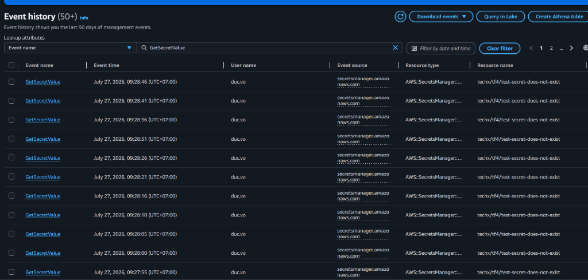
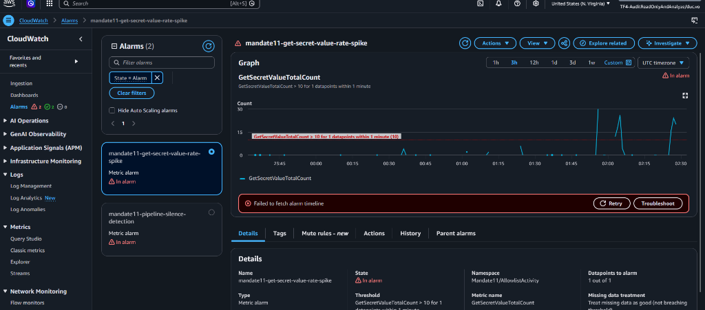
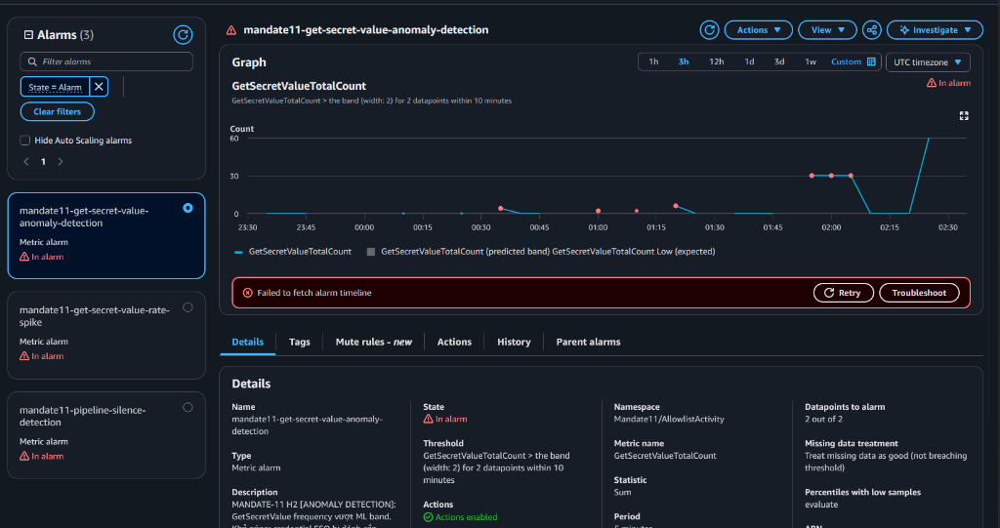

# Hướng Dẫn Chạy Giả Lập & Bằng Chứng Kiểm Thử Thực Tế (H2 Anomaly Detection)

Tài liệu này hướng dẫn cách sử dụng script `simulate_eso_exfil.py` để giả lập hành vi tấn công/bất thường (Exfiltration Spam) nhằm kiểm thử hệ thống Anomaly Detection (H2) trên môi trường AWS thật, đồng thời lưu trữ các bằng chứng nghiệm thu (DoD Evidence).

---

## 1. Giới thiệu Script Giả Lập `simulate_eso_exfil.py`

Script [simulate_eso_exfil.py](./simulate_eso_exfil.py) được thiết kế để tự động gửi liên tục các API call `GetSecretValue` tới AWS Secrets Manager nhằm mô phỏng hành vi rò rỉ dữ liệu hoặc quét secrets tần suất cao từ các identities (như Role của Pod ESO).

### Các tính năng chính:
*   **Không hardcode:** Cho phép truyền AWS Profile, Region, Secret ID, số lượng request và độ trễ qua tham số dòng lệnh (CLI).
*   **Tự động nhận diện quyền:** Tự động sử dụng AWS Session mặc định hoặc IAM Role của EKS Pod (IRSA) khi chạy trong container mà không cần truyền profile.
*   **Hỗ trợ Unicode:** Hiển thị tiếng Việt có dấu trực quan trên terminal Windows/Linux mà không bị lỗi font hoặc crash encoding.

### Hướng dẫn chạy:
Để kích hoạt Alarm thành công (ngưỡng tĩnh > 10 requests/phút), ta cần duy trì tần suất gọi API lớn hơn 10 lần/phút trong ít nhất 2 phút để phủ kín các chu kỳ quét của CloudWatch.

Chạy lệnh sau trên terminal:
```powershell
python simulate_eso_exfil.py --profile TF4-AuditReadOnlyAndAnalyze-511825856493 --count 30 --delay 4
```

---

## 2. Bằng Chứng Thực Tế (DoD Evidence)

Dưới đây là các bằng chứng thu thập được sau khi chạy giả lập thành công trên môi trường AWS thật:

### A. Ghi nhận sự kiện trên CloudTrail
CloudTrail đã bắt thành công 15 requests gọi `GetSecretValue` từ actor `duc.vo` (sử dụng SSO profile) cách nhau đều đặn mỗi 4-5 giây:



### B. CloudWatch Alarm Ngưỡng Tĩnh (Static Threshold Rate-Spike) Báo Động
Sau khi nhận được số lượng cuộc gọi vượt ngưỡng (> 10 lần/phút), Alarm `mandate11-get-secret-value-rate-spike` đã chuyển sang trạng thái **In alarm** màu đỏ:



### C. CloudWatch Alarm Học Máy (ML Anomaly Detection) Báo Động
Do tần suất cuộc gọi tăng đột biến vượt ngoài dải dự đoán (ML prediction band), Alarm học máy `mandate11-get-secret-value-anomaly-detection` cũng đã chuyển sang trạng thái **In alarm** thành công:


